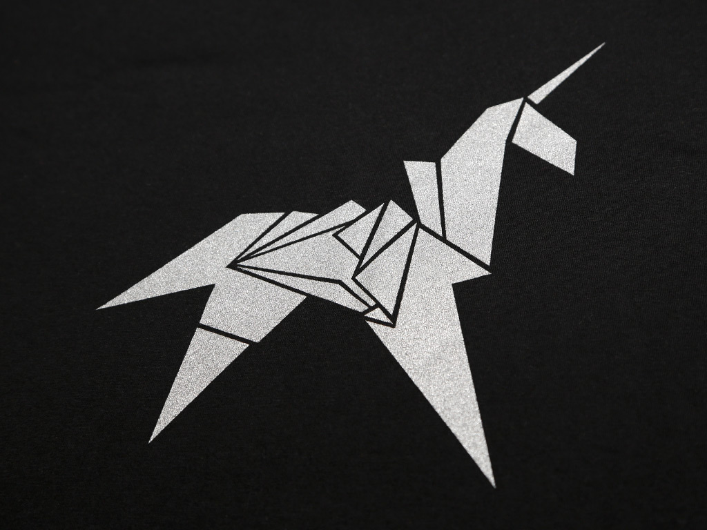

  
  

<!--img align="right" src="https://visitor-badge.laobi.icu/badge?page_id=BengalPirate.BengalPirate" /-->

<!--  -->
 

<h1 align="center">
  
</h1>

  
About Me

    
    
    
  
(click the GIFs for good music)

<h3 align="center">A passionate full stack software developer, computer engineer and cybersecurity enthusiast</h3>

 

 🔭 I’m currently working on **1. A Cross Platform Medical EHR App and 2. An action rpg game for Android and iOS**
 
 🌱 I’m currently learning **Flutter, React.js, Security+, Bash Scripting, and how to design PCBs as well as DevOps**
 
 👯 I’m looking to collaborate on **A Medical AR/VR Project for the the XReal Air 2 Ultra (once released)**
 
 🤔 I’m looking for help with **Leetcode 😭**
  <!-- -- 💬 Ask me about ...              - 📫 How to reach me: ... - 😄 Pronouns: **he/him** -->
 ⚡ Fun fact: **Venus rotates so slowly that a day there is longer than a year on Earth**

  
  <!---->
  
  
   
  

  
  

 

<h2 align="center">
  
  
  Languages-Frameworks-Tools 
  
  
</h2>

 

  <a href="https://skillicons.dev">
     
     
    
    
    <!-- -->
  </a>

  <h2>   My Contributions <a href="https://www.youtube.com/watch?v=I2cmgH60J0Y">  </h2>
   
  

     

Chess Match 
(there is a slight delay before movement is updated, please wait 5 min, will speed up in future)
(work in progress, please ignore for now, trying to integrate A.I. properly as black)

This is an open chess tournament where ANYONE can play. That's the fun part.  
(All profile visitors play on a team for white and black)
It's your turn to play! Move a <!-- BEGIN TURN -->white<!-- END TURN --> piece.

<!-- BEGIN CHESS BOARD -->
|   | A | B | C | D | E | F | G | H |   |
|---|:-:|:-:|:-:|:-:|:-:|:-:|:-:|:-:|:-:|
| **8** |  |  |  |  |  |  |  |  | **8** |
| **7** |  |  |  |  |  |  |  |  | **7** |
| **6** |  |  |  |  |  |  |  |  | **6** |
| **5** |  |  |  |  |  |  |  |  | **5** |
| **4** |  |  |  |  |  |  |  |  | **4** |
| **3** |  |  |  |  |  |  |  |  | **3** |
| **2** |  |  |  |  |  |  |  |  | **2** |
| **1** |  |  |  |  |  |  |  |  | **1** |
|   | **A** | **B** | **C** | **D** | **E** | **F** | **G** | **H** |   |
<!-- END CHESS BOARD -->

**It's your turn to move! Choose one from the following table**
<!-- BEGIN MOVES LIST -->
|  FROM  | TO (Just click a link!) |
| :----: | :---------------------- |
| **A1** | [A2](https://github.com/BengalPirate/BengalPirate/issues/new?body=Please+do+not+change+the+title.+Just+click+%22Submit+new+issue%22.+You+don%27t+need+to+do+anything+else+%3AD&title=Chess%3A+Move+A1+to+A2) |
| **A4** | [A5](https://github.com/BengalPirate/BengalPirate/issues/new?body=Please+do+not+change+the+title.+Just+click+%22Submit+new+issue%22.+You+don%27t+need+to+do+anything+else+%3AD&title=Chess%3A+Move+A4+to+A5), [A6](https://github.com/BengalPirate/BengalPirate/issues/new?body=Please+do+not+change+the+title.+Just+click+%22Submit+new+issue%22.+You+don%27t+need+to+do+anything+else+%3AD&title=Chess%3A+Move+A4+to+A6), [A7](https://github.com/BengalPirate/BengalPirate/issues/new?body=Please+do+not+change+the+title.+Just+click+%22Submit+new+issue%22.+You+don%27t+need+to+do+anything+else+%3AD&title=Chess%3A+Move+A4+to+A7), [B3](https://github.com/BengalPirate/BengalPirate/issues/new?body=Please+do+not+change+the+title.+Just+click+%22Submit+new+issue%22.+You+don%27t+need+to+do+anything+else+%3AD&title=Chess%3A+Move+A4+to+B3), [B5](https://github.com/BengalPirate/BengalPirate/issues/new?body=Please+do+not+change+the+title.+Just+click+%22Submit+new+issue%22.+You+don%27t+need+to+do+anything+else+%3AD&title=Chess%3A+Move+A4+to+B5), [C2](https://github.com/BengalPirate/BengalPirate/issues/new?body=Please+do+not+change+the+title.+Just+click+%22Submit+new+issue%22.+You+don%27t+need+to+do+anything+else+%3AD&title=Chess%3A+Move+A4+to+C2), [C6](https://github.com/BengalPirate/BengalPirate/issues/new?body=Please+do+not+change+the+title.+Just+click+%22Submit+new+issue%22.+You+don%27t+need+to+do+anything+else+%3AD&title=Chess%3A+Move+A4+to+C6), [D1](https://github.com/BengalPirate/BengalPirate/issues/new?body=Please+do+not+change+the+title.+Just+click+%22Submit+new+issue%22.+You+don%27t+need+to+do+anything+else+%3AD&title=Chess%3A+Move+A4+to+D1), [D7](https://github.com/BengalPirate/BengalPirate/issues/new?body=Please+do+not+change+the+title.+Just+click+%22Submit+new+issue%22.+You+don%27t+need+to+do+anything+else+%3AD&title=Chess%3A+Move+A4+to+D7) |
| **B1** | [C3](https://github.com/BengalPirate/BengalPirate/issues/new?body=Please+do+not+change+the+title.+Just+click+%22Submit+new+issue%22.+You+don%27t+need+to+do+anything+else+%3AD&title=Chess%3A+Move+B1+to+C3) |
| **B4** | [B5](https://github.com/BengalPirate/BengalPirate/issues/new?body=Please+do+not+change+the+title.+Just+click+%22Submit+new+issue%22.+You+don%27t+need+to+do+anything+else+%3AD&title=Chess%3A+Move+B4+to+B5), [C5](https://github.com/BengalPirate/BengalPirate/issues/new?body=Please+do+not+change+the+title.+Just+click+%22Submit+new+issue%22.+You+don%27t+need+to+do+anything+else+%3AD&title=Chess%3A+Move+B4+to+C5) |
| **C1** | [B2](https://github.com/BengalPirate/BengalPirate/issues/new?body=Please+do+not+change+the+title.+Just+click+%22Submit+new+issue%22.+You+don%27t+need+to+do+anything+else+%3AD&title=Chess%3A+Move+C1+to+B2) |
| **D2** | [D3](https://github.com/BengalPirate/BengalPirate/issues/new?body=Please+do+not+change+the+title.+Just+click+%22Submit+new+issue%22.+You+don%27t+need+to+do+anything+else+%3AD&title=Chess%3A+Move+D2+to+D3), [D4](https://github.com/BengalPirate/BengalPirate/issues/new?body=Please+do+not+change+the+title.+Just+click+%22Submit+new+issue%22.+You+don%27t+need+to+do+anything+else+%3AD&title=Chess%3A+Move+D2+to+D4) |
| **E1** | [D1](https://github.com/BengalPirate/BengalPirate/issues/new?body=Please+do+not+change+the+title.+Just+click+%22Submit+new+issue%22.+You+don%27t+need+to+do+anything+else+%3AD&title=Chess%3A+Move+E1+to+D1) |
| **E2** | [E3](https://github.com/BengalPirate/BengalPirate/issues/new?body=Please+do+not+change+the+title.+Just+click+%22Submit+new+issue%22.+You+don%27t+need+to+do+anything+else+%3AD&title=Chess%3A+Move+E2+to+E3), [E4](https://github.com/BengalPirate/BengalPirate/issues/new?body=Please+do+not+change+the+title.+Just+click+%22Submit+new+issue%22.+You+don%27t+need+to+do+anything+else+%3AD&title=Chess%3A+Move+E2+to+E4) |
| **F2** | [F3](https://github.com/BengalPirate/BengalPirate/issues/new?body=Please+do+not+change+the+title.+Just+click+%22Submit+new+issue%22.+You+don%27t+need+to+do+anything+else+%3AD&title=Chess%3A+Move+F2+to+F3), [F4](https://github.com/BengalPirate/BengalPirate/issues/new?body=Please+do+not+change+the+title.+Just+click+%22Submit+new+issue%22.+You+don%27t+need+to+do+anything+else+%3AD&title=Chess%3A+Move+F2+to+F4) |
| **G1** | [F3](https://github.com/BengalPirate/BengalPirate/issues/new?body=Please+do+not+change+the+title.+Just+click+%22Submit+new+issue%22.+You+don%27t+need+to+do+anything+else+%3AD&title=Chess%3A+Move+G1+to+F3), [H3](https://github.com/BengalPirate/BengalPirate/issues/new?body=Please+do+not+change+the+title.+Just+click+%22Submit+new+issue%22.+You+don%27t+need+to+do+anything+else+%3AD&title=Chess%3A+Move+G1+to+H3) |
| **G2** | [G3](https://github.com/BengalPirate/BengalPirate/issues/new?body=Please+do+not+change+the+title.+Just+click+%22Submit+new+issue%22.+You+don%27t+need+to+do+anything+else+%3AD&title=Chess%3A+Move+G2+to+G3), [G4](https://github.com/BengalPirate/BengalPirate/issues/new?body=Please+do+not+change+the+title.+Just+click+%22Submit+new+issue%22.+You+don%27t+need+to+do+anything+else+%3AD&title=Chess%3A+Move+G2+to+G4) |
| **H2** | [H3](https://github.com/BengalPirate/BengalPirate/issues/new?body=Please+do+not+change+the+title.+Just+click+%22Submit+new+issue%22.+You+don%27t+need+to+do+anything+else+%3AD&title=Chess%3A+Move+H2+to+H3), [H4](https://github.com/BengalPirate/BengalPirate/issues/new?body=Please+do+not+change+the+title.+Just+click+%22Submit+new+issue%22.+You+don%27t+need+to+do+anything+else+%3AD&title=Chess%3A+Move+H2+to+H4) |
<!-- END MOVES LIST -->

Having fun? Ask a friend to do the next move!

#### How it works

When you click on a link and submit a new issue with the desired move, a GitHub action is triggered, which in turn runs a small python script that performs the specified movement, updates this README file and commits the changes.

  
Last 5 moves in this game

<!-- BEGIN LAST MOVES -->

| Move | Author |
| :--: | :----- |
| `E7` to `E5` | [ @Svaarich](https://github.com/Svaarich) |
| `D1` to `A4` | [ @ShalmonAnandas](https://github.com/ShalmonAnandas) |
| `C6` to `C5` | [ @UTkbxRME7c9C](https://github.com/UTkbxRME7c9C) |
| `C2` to `C4` | [ @slflores0911](https://github.com/slflores0911) |
| `G8` to `F6` | [ @zylim1128](https://github.com/zylim1128) |

<!-- END LAST MOVES -->

  
Top 10 most moves across all games

<!-- BEGIN TOP MOVES -->

| Total moves |  User  |
| :---------: | :----- |
| 2 | [@BengalPirate](https://github.com/BengalPirate) |
| 1 | [@IamTemmy](https://github.com/IamTemmy) |
| 1 | [@devinscott25](https://github.com/devinscott25) |
| 1 | [@zylim1128](https://github.com/zylim1128) |
| 1 | [@slflores0911](https://github.com/slflores0911) |
| 1 | [@UTkbxRME7c9C](https://github.com/UTkbxRME7c9C) |
| 1 | [@ShalmonAnandas](https://github.com/ShalmonAnandas) |
| 1 | [@Svaarich](https://github.com/Svaarich) |

<!-- END TOP MOVES -->

---

